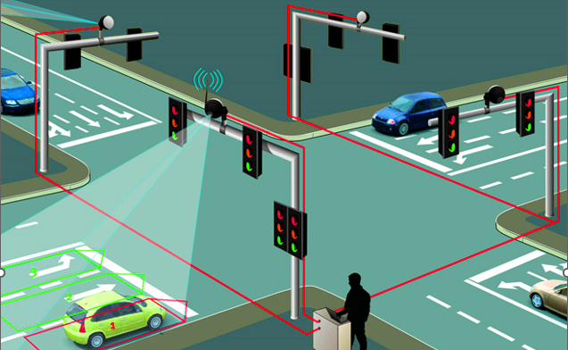

## Density Based TLC System

## Table of Contents

- [Introduction](#introduction)
- [Features](#features)
- [Build Process](#build-process)
- [Tech Stack](#tech-stack)

 

## Introduction

This is a simulation of traffic light system using real time traffic density data to calculate optimal green signal time for each lane. This project was an university project which was done under embedded systems course unit.

## Features

🚀 Green light time based on Traffic Density  
🚀 Vehicle Counting using OpenCV  
🚀 Controll Arduino Uno using python script

## Build Process

- Clone or download the repo

- Install required packages

  - `pip install opencv-contrib-python`
  - `pip install matplotlib`
  - `pip install pygame`
  - `pip install pyFirmata`

- `python [filename]` to run the application

## Tech Stack

    
    

## Project Goals & Outcomes

✔️ Learning Parallel Execution using Python  
✔️ Learning Image Processing using OpenCV  
✔️ Controlling Arduino UNO with python script
